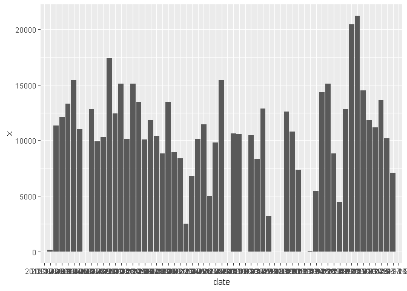
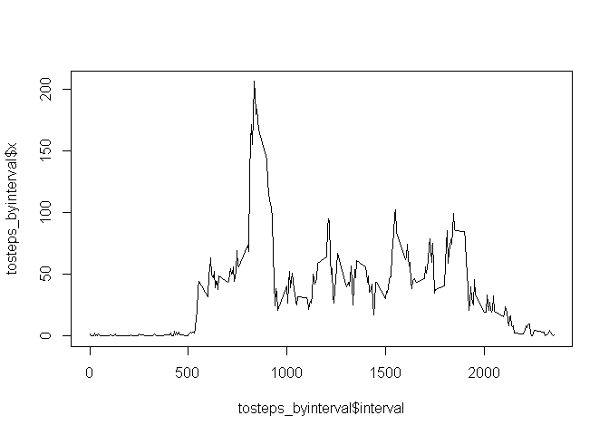
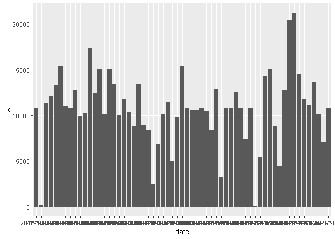
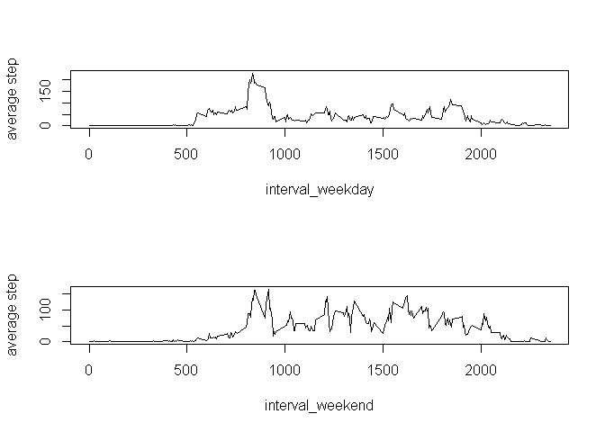

## Loading and preprocessing the data

```r
setwd("C:/Users/snakely1987")
activity=read.csv("activity.csv",header = T)
```


## What is mean total number of steps taken per day?
###1.Make a histogram of the total number of steps taken each day

```r
tosteps_byday=aggregate(activity[,1],by=list(date=activity$date),sum,na.rm=T)
library(ggplot2)
```

```
## Warning: package 'ggplot2' was built under R version 3.4.4
```

```r
ggplot(tosteps_byday, aes(x=date, y=x)) + geom_bar(stat="identity")
```

<!-- -->

###2.Calculate and report the mean and median total number of steps taken per day

```r
mean_steps=round(mean(tosteps_byday[,2]),digits = 2)
median_steps=median(tosteps_byday[,2])
```
The mean total number of steps taken per day is **9354.23**
The median total number of steps taken per day is **10395**


## What is the average daily activity pattern?
###1.Make a time series plot (i.e. type = "l") of the 5-minute interval (x-axis) and the average number of steps taken, averaged across all days (y-axis)

```r
tosteps_byinterval=aggregate(activity[,1],by=list(interval=activity$interval),mean,na.rm=T)
plot(tosteps_byinterval$interval,tosteps_byinterval$x,type = "l")
```

<!-- -->

###2.Which 5-minute interval, on average across all the days in the dataset, contains the maximum number of steps?

```r
max_interval=tosteps_byinterval[which.max(tosteps_byinterval[,2]),][1]
```
The inverval **835**,on average across all the days in the dataset, contains the maximum number of steps


## Imputing missing values
###1.Calculate and report the total number of missing values in the dataset (i.e. the total number of rows with NAs)

```r
num_nas=sum(is.na(activity[,1]))
```
The total number of rows with NAs is **2304**

###2.Devise a strategy for filling in all of the missing values in the dataset. The strategy does not need to be sophisticated. For example, you could use the mean/median for that day, or the mean for that 5-minute interval, etc.

```r
tosteps_byinterval=aggregate(activity[,1],by=list(interval=activity$interval),mean,na.rm=T)
head(tosteps_byinterval)
```

```
##   interval         x
## 1        0 1.7169811
## 2        5 0.3396226
## 3       10 0.1320755
## 4       15 0.1509434
## 5       20 0.0754717
## 6       25 2.0943396
```
The missing valu for each 5-minute interval is the mean for that 5-minute interval

###3.Create a new dataset that is equal to the original dataset but with the missing data filled in.

```r
na=which(is.na(activity[,1]))
num=length(na)
activity_new=activity
for(i in 1:num)
{
  activity_new[na[i],1]=tosteps_byinterval[which(tosteps_byinterval[,1]==activity[na[i],3]),2]
}
num_nas_new=sum(is.na(activity_new[,1]))
```
The total number of rows with NAs from activity_new  is **0**

###4.Make a histogram of the total number of steps taken each day and Calculate and report the mean and median total number of steps taken per day. Do these values differ from the estimates from the first part of the assignment? What is the impact of imputing missing data on the estimates of the total daily number of steps?

```r
tosteps_byday_new=aggregate(activity_new[,1],by=list(date=activity_new$date),sum,na.rm=T)
library(ggplot2)
ggplot(tosteps_byday_new, aes(x=date, y=x)) + geom_bar(stat="identity")
```

<!-- -->

```r
mean_steps_new=round(mean(tosteps_byday_new[,2]),digits = 2)
median_steps_new=round(median(tosteps_byday_new[,2]),digits = 2)
```
The mean total number of steps taken per day is **9354.23**    
The mean total number of steps taken per day from activity_new is **1.076619\times 10^{4}**    
The median total number of steps taken per day is **10395**    
The median total number of steps taken per day from activity_new is **1.076619\times 10^{4}**  

After imputing missing data the mean total number of steps taken per day is equal to the median total number of steps taken per day.


## Are there differences in activity patterns between weekdays and weekends?
###1.Create a new factor variable in the dataset with two levels -- "weekday" and "weekend" indicating whether a given date is a weekday or weekend day.

```r
week=weekdays(as.Date(activity_new[,2]))
weekday=rep("weekday",length(week))
weekday[which(week%in%c("星期六","星期日"))]="weekend"
activity_new=data.frame(activity_new,weekday_weekend=as.factor(weekday))
summary(activity_new)
```

```
##      steps                date          interval      weekday_weekend
##  Min.   :  0.00   2012-10-01:  288   Min.   :   0.0   weekday:12960  
##  1st Qu.:  0.00   2012-10-02:  288   1st Qu.: 588.8   weekend: 4608  
##  Median :  0.00   2012-10-03:  288   Median :1177.5                  
##  Mean   : 37.38   2012-10-04:  288   Mean   :1177.5                  
##  3rd Qu.: 27.00   2012-10-05:  288   3rd Qu.:1766.2                  
##  Max.   :806.00   2012-10-06:  288   Max.   :2355.0                  
##                   (Other)   :15840
```


###2.Make a panel plot containing a time series plot (i.e. type = "l") of the 5-minute interval (x-axis) and the average number of steps taken, averaged across all weekday days or weekend days (y-axis). The plot should look something like the following, which was created using simulated data

```r
activity_new_weekday=subset(activity_new,activity_new$weekday_weekend=="weekday")
activity_new_weekend=subset(activity_new,activity_new$weekday_weekend=="weekend")
tosteps_byinterval_weekday=aggregate(activity_new_weekday[,1],by=list(interval=activity_new_weekday$interval),mean,na.rm=T)
tosteps_byinterval_weekend=aggregate(activity_new_weekend[,1],by=list(interval=activity_new_weekend$interval),mean,na.rm=T)
par(mfrow=c(2,1))
plot(tosteps_byinterval_weekday$interval,tosteps_byinterval_weekday$x,type = "l",xlab="interval_weekday",ylab="average step")
plot(tosteps_byinterval_weekend$interval,tosteps_byinterval_weekend$x,type = "l",xlab="interval_weekend",ylab="average step")
```

<!-- -->

